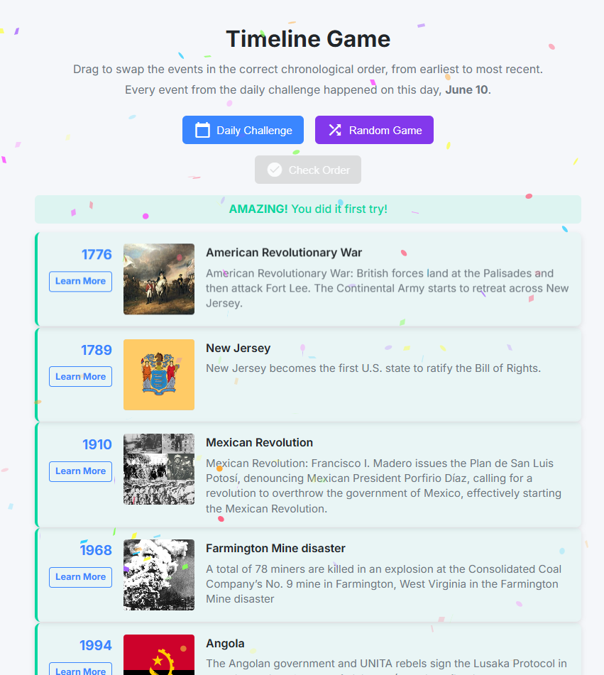

# Timeline Game

A game where players arrange historical events in chronological order. The game fetches historical events from Wikipedia.



## Made with

- [Spin](https://developer.fermyon.com/spin/install) - Wasm runtime
- [TinyGo](https://tinygo.org/) - Go Wasm compiler
- [Wikipedia API by Byabbe](https://byabbe.se/on-this-day/#/)

## Setup

1. Clone this repository.
2. Build the application
   ```bash
   spin build
   ```
   Run the application
    ```bash
    spin up
    ```
    Navigate to `http://localhost:3000`

3. Or deploy to [Fermyon Cloud](https://www.fermyon.com/cloud)

## How to Play

1. Drag and drop the events in chronological order earliest to most recent.
3. Click "Check Order" to check your answer. Try to get all right with the least tries.
4. Click "New Game" to play again.

## License

MIT License